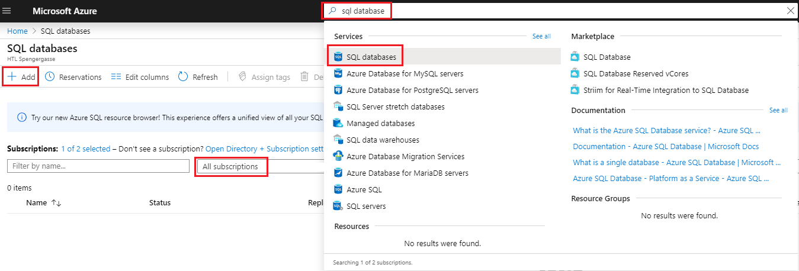
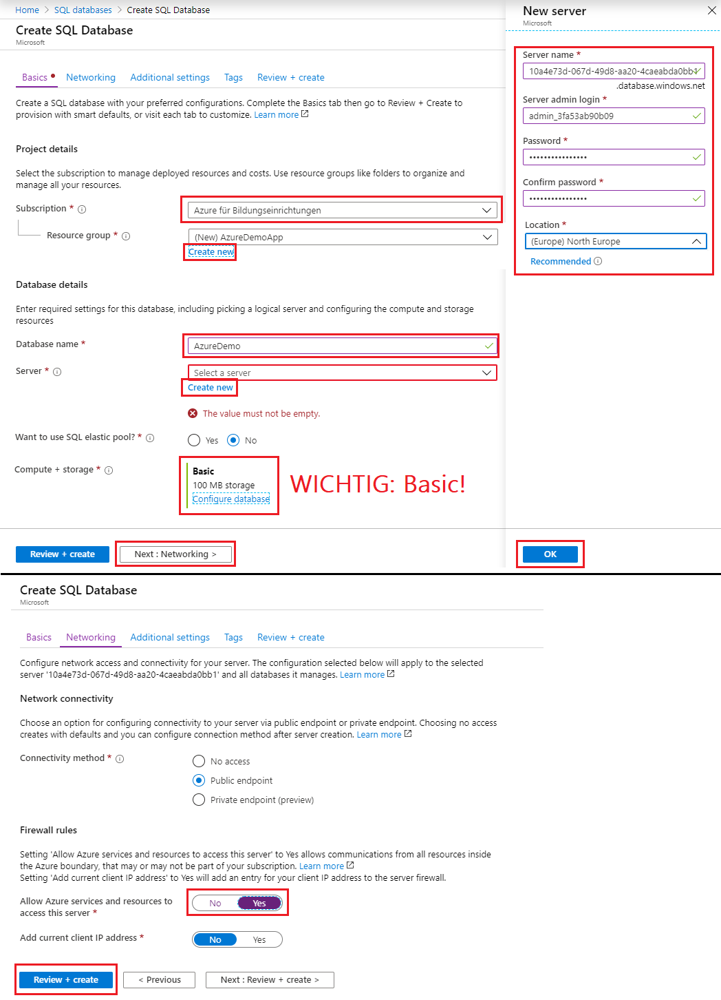
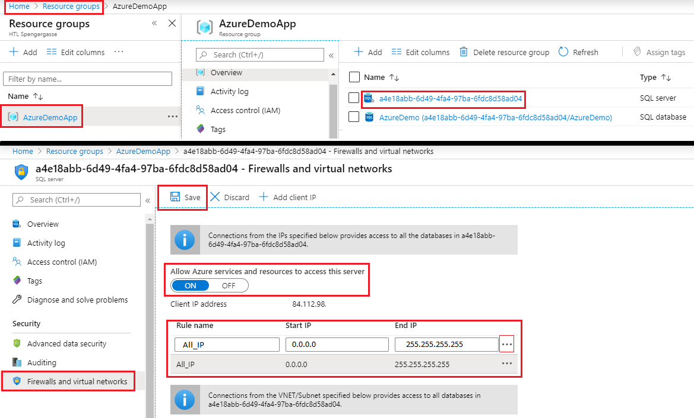
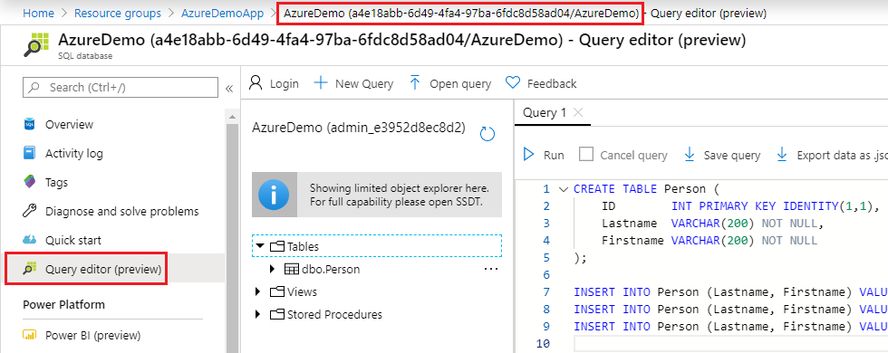

# Einrichtung einer SQL Server Datenbank

## Vorbereitung

Lade das [SQL Server Management Studio (SSMS)](https://docs.microsoft.com/en-us/sql/ssms/download-sql-server-management-studio-ssms)
für den Zugriff auf den SQL Server in Azure herunter.

Für Linux oder macOS kann [DBeaver](https://dbeaver.io/) verwendet werden. Er basiert auf der JDBC
Treiberarchitektur und kann auch auf die Azure SQL Datenbank zugreifen.

## Anlegen der SQL Server Datenbank in Azure

Suche im Portal nach den Service *SQL Databases*. Im nachfolgenden Dialog kann mit *Add* eine
neue Datenbank angelegt werden.


Beim Anlegen muss die richtige Subscription gewählt werden (*Azure für Bildungseinrichtungen* ohne Starter).
Als Resource gruop wählen wir *AzureDemoApp*. Zu dieser Gruppe werden wir dann auch das App Service
hinzufügen.

> **Achtung**: Wähle bei *Compute + storage* den billigsten Plan (Basic). Beim voreingestellten Plan
> würde das Guthaben nach wenigen Tagen aufgebraucht sein!



## Setzen der Firewallregeln

Damit wir uns von überall aus mit dem SQL Server verbinden können, erlauben wir den Zugriff für
alle IP Adressen. Gehe dafür über die Resource Group auf den SQL Server (nicht die SQL Database)
und aktiviere unter *Firewalls and virtual Networks* die Regeln:



## Verwenden des Query editor

In den Einstellungen der Datenbank (nicht des SQL Servers) gibt es auch einen Query editor, indem
auch ohne Management Studio Abfragen ausgeführt werden können.



## Verbinden mit dem SQL Server Management Studio

Mit den bei *Create new server* eingegebenen Daten kannst du dich nun aus dem SQL Server Management
Studio (SSMS) verbinden.

- Servername: ???????.database.windows.net
- Authentication: SQL Server Authentication
- Login:    ?????
- Passwort: ?????

### Erstellen einer Testtabelle

Um sicher zu stellen, ob alles funktioniert, legen wir eine Tabelle *Person* mit 3 Einträgen an:

```sql
CREATE TABLE Person (
    ID        INT PRIMARY KEY IDENTITY(1,1),
    Lastname  VARCHAR(200) NOT NULL,
    Firstname VARCHAR(200) NOT NULL
);

INSERT INTO Person (Lastname, Firstname) VALUES ('Lastname1', 'Firstname1');
INSERT INTO Person (Lastname, Firstname) VALUES ('Lastname2', 'Firstname2');
INSERT INTO Person (Lastname, Firstname) VALUES ('Lastname3', 'Firstname3');
```

### Anlegen eines weiteren Users für die Datenbank AzureDemo

In unserem Programm verwenden wir natürlich nicht den Admin, um sich zur Datenbank zu verbinden.
Deswegen legen wir einen weiteren Benutzer an, der in der Datenbank lediglich lesen und schreiben,
jedoch keine Änderungen am Schema vornehmen kann.

Dafür selektieren wir die Datenbank *master* bzw. *AzureDemo* im SQL Server Management Studio und führen die
folgenden Befehle aus. Das Passwort muss Groß- und Kleinbuchstaben sowie Ziffern oder Sonderzeichen
enthalten.


In der Datenbank *master* wird folgender Befehl ausgeführt:

```sql
CREATE USER Demouser WITH PASSWORD = '?????';   -- Statt Demouser kommt der Username
```

In der Datenbank *AzureDemo* werden folgende Befehle ausgeführt:

```sql
CREATE USER Demouser WITH PASSWORD = '?????';   -- Statt Demouser kommt der Username
ALTER ROLE db_datareader ADD MEMBER Demouser;   -- Statt Demouser kommt der Username
ALTER ROLE db_datawriter ADD MEMBER Demouser;   -- Statt Demouser kommt der Username
```

## Anzeigen des Verbindungsstrings

In den Einstellungen der SQL Datenbank (nicht des SQL Servers) kann unter *Settings* > *Connection Strings*
auch der Verbindungsstring angezeigt werden, der in den Programmen dann verwendet werden kann.
