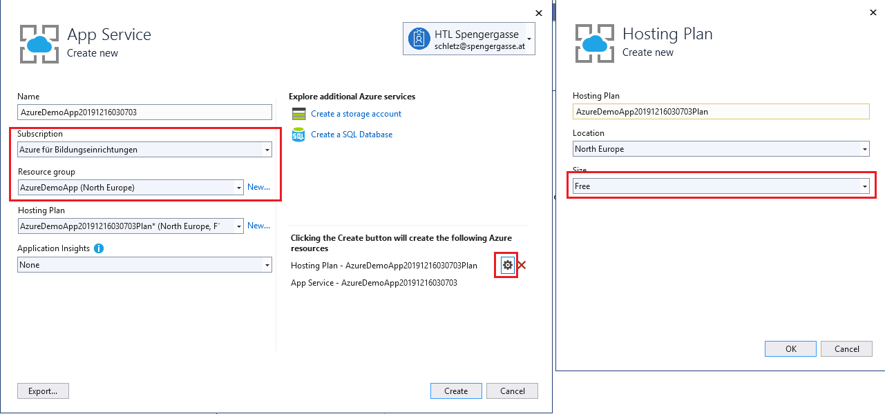

# Erstellen eines App Service

## Erstellen einer webapi von der Konsole aus

Neue WebAPI Projekte können auch von der Konsole aus erstellt werden, indem ein neuer Ordner (z. B. *AzureDemo*)
erstellt wird. In diesem Ordner werden dann folgende Befehle ausgeführt. Der Connection String muss
allerdings noch an die eigenen Einstellungen angepasst werden.

### Erstellen einer WebAPI mit SQL Server in Azure

```text
dotnet new webapi
dotnet tool update --global dotnet-ef
dotnet add package Microsoft.EntityFrameworkCore.Tools
dotnet add package Microsoft.EntityFrameworkCore.SqlServer
dotnet ef dbcontext scaffold "Server=aaaaa.database.windows.net;Database=bbbbb;User id=ccccc;Password=ddddd" Microsoft.EntityFrameworkCore.SqlServer --output-dir Model --use-database-names --force --data-annotations
```

Beim Verbindungsstring von scaffold sind folgende Dinge anzupassen:

- *aaaaa.database.windows.net*: Durch den Servernamen des SQL Servers auf Azure zu ersetzen
- *Database=bbbbb*: Durch den Datenbanknamen auf Azure zu ersetzen
- *User id=ccccc*:  Benutzername unseres App Users, der im vorigen Kapitel erstellt wurde.
- *Password=ddddd*: Passwort des App Users, der im vorigen Kapitel erstellt wurde.

### Erstellen einer WebAPI mit SQLite

```text
dotnet new webapi
dotnet tool update --global dotnet-ef
dotnet add package Microsoft.EntityFrameworkCore.Tools
dotnet add package Microsoft.EntityFrameworkCore.SqlServer
dotnet ef dbcontext scaffold "DataSource=aaaa.db" Microsoft.EntityFrameworkCore.Sqlite --output-dir Model --use-database-names --force --data-annotations
```

Beim Verbindungsstring von scaffold sind folgende Dinge anzupassen:

- *DataSource=aaaa.db:* Durch den Datenbanknamen der SQLite Datei zu ersetzen.

## Publishing mit Visual Studio

### launchSettings.json

Folgende Einstellungen hören auf den Standardports für HTTP und HTTPS

```js
{
  "$schema": "http://json.schemastore.org/launchsettings.json",
  "profiles": {
    "AzureDemoApp": {
      "commandName": "Project",
      "launchBrowser": true,
      "applicationUrl": "https://0.0.0.0:443;http://0.0.0.0:80",
      "environmentVariables": {
        "ASPNETCORE_ENVIRONMENT": "Development"
      }
    }
  }
}

```

### ConfigureServices

Der DbContext wird mit *AddDbContext()* hinzugefügt.

```c#
public void ConfigureServices(IServiceCollection services)
{
    services.AddControllers();
    services.AddDbContext<AzureDemoDatabaseContext>();
}
```

## Publishing

Mit der rechten Maustaste kann in Visual Studio beim Projekt der Punkt *Publish* gewählt werden.
Auch hier ist darauf zu achten, dass das niedrigste Paket gewählt wird.



## Aktivieren des Development Profiles

Falls Fehler auftreten, werden keine Beschreibungen dazu in Azure angezeigt. Das liegt daran, dass diese
nur im Profil *Development* sichtbar sind. Um das zu aktivieren, klicke in https://portal.azure.com
unter *App Services* auf deine App. Unter den Einstellungen kann nun die Umgebungsvariable
*ASPNETCORE_ENVIRONMENT* auf *Development* gesetzt werden.


## Aktivieren von MySQL in App

In Azure kann - ebenfalls unter *Settings* des App Serivce - der Punkt *MySQL in App* aktiviert
werden. Dabei wird ein Connectionstring angeboten, der in der Datei *Startup.cs* der ASP.NET
Core Applikation verwendet werden kann:

```c#
string connectionString = Environment.GetEnvironmentVariable("MYSQLCONNSTR_localdb")
    ?.Replace("Data Source", "Server")
    ?.Replace("User Id", "User") ?? "";             // Schöner: String aus appsettings.json statt ""
services.AddDbContext<ApplicationDbContext>(options =>  
    options.UseMySql(connectionString)
);
```

In Windows kann diese Variable *MYSQLCONNSTR_localdb* zum Testen angelegt werden (*Start* -
*Environment Variables*). Diese muss einen Connectionstring liefern, wie ihn auch Azure liefern würde.
Die einzelnen Werte können natürlich an das lokale System angepasst werden.

```text
Database=localdb;Data Source=127.0.0.1:50513;User Id=azure;Password=xxxxxx
```

Natürlich sind auch andere Varianten dieses Codes möglich. So kann z. B. wenn *GetEnvironmentVariable()*
null liefert, nicht der Leerstring sondern der String aus der Datei *appsettings.json* geladen werden.
