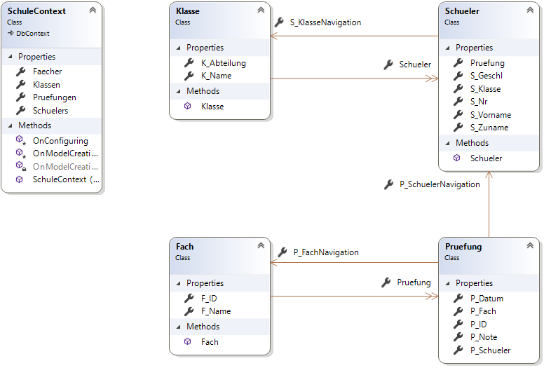
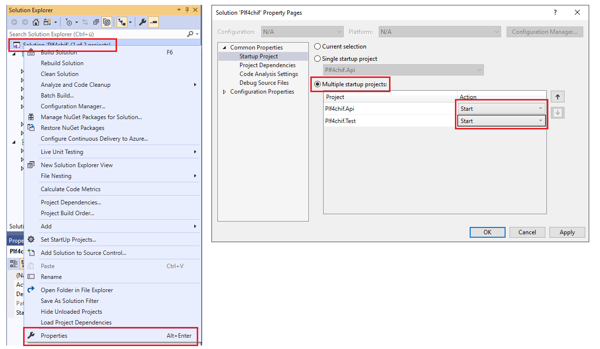

# 1. PLF in Programmieren

| Thema     |  REST API in ASP.NET Core   |
| --------- | --------------------------- |
| Datum     | 17. Oktober 2019            |
| Klasse    | 4CHIF                       |


In diesem Ordner befindet sich eine Visual Studio 2019 Solution mit 2 Projekten:
- *Plf4chif.App*: Die ASP.NET Core Applikation.
- *Plf4chif.Test*: Ein Konsolenprogramm zum Testen der Routen.

## Intro
Für diese Prüfung wurde die bekannte Schuldatenbank um 2 Tabellen erweitert: *Fach* und *Pruefung*. In der
Tabelle *Pruefung* werden Prüfungantritte von Schülern verwaltet:

| P_ID 	| P_Datum   	| P_Schueler	| P_Fach	| P_Note	| 
| -----	| ----------	| ----------	| ------	| ------	| 
| 1001	| 17.10.2019	| 1001      	| POS1  	| 5     	| 
| 1002	| 17.10.2019	| 2001      	| E     	| 2     	| 
| 1004	| 17.10.2019	| 1002      	| AM    	| 2     	| 

Die Spalte *P_ID* ist ein Autowert. *P_Schueler* und *P_Fach* sind Fremdschlüssel für die entsprechenden
Tabellen.

In der ASP.NET Core Applikation sind die Modelklassen bereits generiert. Das Programm greift auf die
im Rootordner liegende Datenbank *Schule.db* zu. Um sich mit der Datenbank zu verbinden, ist eine Instanz
von *SchuleContext* zu erstellen:

```c#
SchuleContext db = new SchuleContext();
```



## Implementierung
Damit die REST API und das Testprogramm starten, müssen beide in Visual Studio als Startprojekt
festgelegt werden. Dies erreicht man durch Rechtsklicken auf die Solution und Einstellen der
Startprojekte:



Erstelle das Projekt nach dem Laden mit *F6*, damit alle Abhängigkeiten geladen werden.
Implementiere folgende Routen in der Datei *PruefungController.cs*. Um das Programm zu testen, führe 
in Visual Studio mit dem Play Button (oder *F5*) beide Projekte aus. Die Testapplikation sendet dabei 
Daten über die *HttpClient* Klasse an den Server und wertet die Antwort aus.

Wer nicht in Visual Studio entwickelt, kann zuerst im Ordner *Plf4chif.Api* den Server starten. Danach
kann im Ordner *Plf4chif.Test* das Testprogramm gestartet werden.
```
...Plf4chif.Api> dotnet run
...Plf4chif.Test> dotnet run
```

### GET /api/pruefung
Liefert alle eingetragenen Prüfungen aus der Datenbank.
- Request Parameter: keine
- Response: 
    - Statuscode: 200 (OK)
- Daten: Ein JSON Array mit den eingetragenen Prüfungen in der Form
```js
[{"P_ID":1001,"P_Schueler":1001,"P_Datum":"2019-10-17T00:00:00","P_Fach":"POS1","P_Note":5},{"P_ID":1002,"P_Schueler":2001,"P_Datum":"2019-10-18T00:00:00","P_Fach":"AM","P_Note":3},{"P_ID":1003,"P_Schueler":2002,"P_Datum":"2019-10-19T00:00:00","P_Fach":"AM","P_Note":2}]
```

### GET /api/pruefung/negative
Liefert alle eingetragenen negativen Prüfungen (P_Note = 5) aus der Datenbank.
- Request Parameter: keine
- Response: 
    - Statuscode: 200 (OK)
- Daten: Ein JSON Array mit den eingetragenen Prüfungen in der Form
```js
[{"P_ID":1001,"P_Schueler":1001,"P_Datum":"2019-10-17T00:00:00","P_Fach":"POS1","P_Note":5}]
```

### GET /api/pruefung/id
Liefert eine Prüfung aus der Datenbank, dessen *P_ID* den übergebenen ID Wert hat.
- Request Parameter: keine
- Response: 
    - Statuscode: 200 (OK), 400 (nicht numerische ID)
- Daten: Ein JSON Object mit den Daten der in id angegebenen Prüfung (Wert von *P_ID*)
```js
{"P_ID":1001,"P_Schueler":1001,"P_Datum":"2019-10-17T00:00:00","P_Fach":"POS1","P_Note":5}
```

### POST /api/pruefung
Fügt die übergebene Prüfung in die Datenbank ein.
- Request Body: Ein JSON Objekt mit der zu erstellenden Prüfung. Die Parameter sind so wie die
  Spaltennamen in der Datenbank benannt. *P_ID* wird nicht übermittelt, sie wird generiert.
- Response: 
    - Statuscode: 200 (OK), 500 (Datenbankfehler)  
- Daten: Ein JSON Object mit den Daten der neu angelegten Prüfung.
```js
{"P_ID":1001,"P_Schueler":1001,"P_Datum":"2019-10-17T00:00:00","P_Fach":"POS1","P_Note":5}
```

### PUT /api/pruefung/id
Aktualisiert die Daten der Prüfung, dessen *P_ID* den übergebenen ID Wert hat.
- Request Body: Ein JSON Objekt mit den neuen Daten zur Prüfung. Die Parameter sind so wie die
  Spaltennamen in der Datenbank benannt. *P_ID* wird nicht übermittelt. Die angegebene ID in der
  URL gibt die zu ändernde Prüfungs ID an.
- Response: 
    - Statuscode: 200 (OK), 400 (nicht numerische ID), 500 (Datenbankfehler)  
- Daten: Ein JSON Object mit den Daten der geänderten Prüfung.
```js
{"P_ID":1001,"P_Schueler":1001,"P_Datum":"2019-10-17T00:00:00","P_Fach":"POS1","P_Note":5}
```

### DELETE /api/pruefung/id
Löscht die Prüfung, dessen *P_ID* den übergebenen ID Wert hat.
- Request Parameter: keine
- Response: 
    - Statuscode: 200 (OK), 400 (nicht numerische ID), 500 (Datenbankfehler)  
- Daten: Ein JSON Object mit den Daten der gelöschten Prüfung.
```js
{"P_ID":1001,"P_Schueler":1001,"P_Datum":"2019-10-17T00:00:00","P_Fach":"POS1","P_Note":5}
```

## Abgabe
Kopiere deine Solution auf *\\\\enterprise\ausbildung\unterricht\abgaben\4CHIF\POS_PLF1* in deinen
persönlichen Ordner. Die sln Datei muss sich direkt in diesem persönlichen Verzeichnis befinden.
