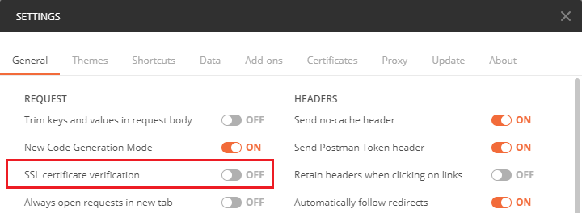
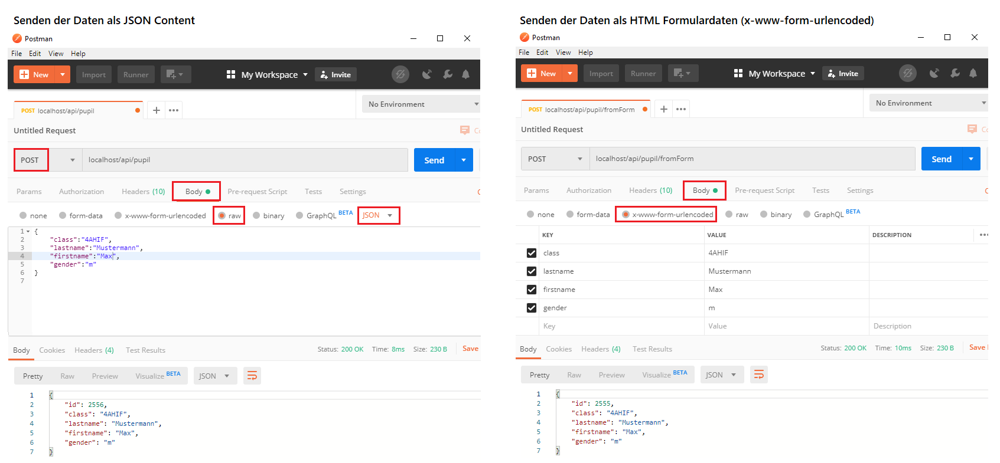

# POST, PUT und DELETE Requests

Bisher haben wir nur auf sogenannte GET Requests reagiert. GET Requests stellen im Webservice
einfache Abfragen dar. Da über ein Webservice auch Daten eingefügt, geändert oder gelöscht werden
sollen, müssen wir die HTTP Methoden POST, PUT und DELETE betrachten.


<sup>Quelle: https://www.edureka.co/blog/what-is-rest-api/</sup>

## Arten der Datenübermittlung

### Im Request Body als JSON

Bei der Kommunikation zwischen 2 Programmen über eine REST Schnittstelle werden die Daten oft direkt
als JSON in den Request Body geschrieben. Bei der Schülerklasse würden folgende Daten übertragen
werden:

```javascript
{
    "id":2553,
    "class":"4AHIF",
    "lastname":"Max32443",
    "firstname":"Mustermann",
    "gender":"m"
}
```

### www-form-urlencoded

POST Daten werden oft von HTML Formularen aus übermittelt. Wir betrachten das folgende kleine HTML
Formular für die Übermittlung von Schülerdaten:

```html
<form action="/api/pupil/fromForm" method="post">
    <input type="text" name="firstname" value="ABC"/>
    <input type="text" name="lastname" value="DEF"/>
    <input type="submit" value="Submit" />
</form>
```

Beim Senden codiert der Browser diese Daten mit dem Content-Type *application/x-www-form-urlencoded*.
Das bedeutet, dass sie im Request so codiert sind, wie sie auch mit einer URL als GET Request 
übertragen werden könnten:

```text
firstname=ABC&lastname=DEF
```

## Implementierung in ASP.NET Core

### POST Requests

Soll ein POST Request verarbeitet werden, dessen Daten als als JSON im Request Body gesendet
werden, so muss nichts weiter gemacht werden. Dies ist nämlich der Standardfall. Der Formatter
erstellt automatisch ein Objekt vom Typ *Pupil* und schreibt die Daten in die entsprechenden Properties.
Die Namen der Parameter müssen natürlich mit den Namen der Properties übereinstimmen, die
Großschreibung wird allerdings nicht beachtet. Durch die Annotation *[HttpPost]* reagiert die Methode
auf POST Requests mit der URL des Controllers.

Können Properties nicht zugeordnet werden, wird es auf den Standardwert (0 oder null) gesetzt. Meist
sind falsche Namen im JSON die Ursache dafür.

```c#
[HttpPost]
[ProducesResponseType(StatusCodes.Status200OK)]
[ProducesResponseType(StatusCodes.Status400BadRequest)]
public ActionResult<Pupil> Post(Pupil pupil)
{
    try
    {
        int newId = db.Pupil.Max(p => p.Id) + 1;          // Simuliert eine Autoincrement Id.
        pupil.Id = newId;
        db.Pupil.Add(pupil);
        return Ok(pupil);                 // Den Schüler mit der generierten Id zurückgeben.
    }
    // Kann der Schüler nicht angelegt werden (z. B. Verletzung von Contraints in der Db),
    // wird 400 geliefert.
    catch
    {
        return BadRequest();
    }
}
```

Soll ein POST Request verarbeitet werden, dessen Daten als *application/x-www-form-urlencoded* gesendet
werden, wird dies mit der Annotation *[FromForm]* bekannt gegeben. Auch hier erstellt der Formatter
automatisch ein Objekt vom Typ *Pupil* und schreibt die Daten in die entsprechenden Properties.
Der Aufruf im folgenden Beispiel wird einfach an die vorige Methode *Post()* mit der C# 7 Syntax
als Lambda weitergeleitet.

```c#
[HttpPost("fromForm")]
[ProducesResponseType(StatusCodes.Status200OK)]
[ProducesResponseType(StatusCodes.Status400BadRequest)]
public ActionResult<Pupil> PostFromForm([FromForm] Pupil pupil) => Post(pupil);
```

### PUT und DELETE Requests

Der Umgang mit PUT und DELETE Requests ist ident mit POST, nur dass die Annotation *[HttpPut]* bzw.
*[HttpDelete]* verwendet wird. Der Umgang mit dem Request Body ist gleich wie bei PUT Requests.

Da PUT Requests für Aktualisierungen und DELETE Requests zum Löschen von Daten verwendet werden, führt
der Code in folgenden Beispielen die entsprechenden Operationen aus.

```c#
[HttpPut("{id}")]
[ProducesResponseType(StatusCodes.Status200OK)]
[ProducesResponseType(StatusCodes.Status400BadRequest)]
[ProducesResponseType(StatusCodes.Status404NotFound)]
public ActionResult<Pupil> Put(int id, Pupil pupil)
{
    try
    {
        Pupil found = db.Pupil.SingleOrDefault(p => p.Id == id);
        if (found == null) { return NotFound(); }
        // Simuliert das Aktualisieren des Datensatzes in der Db. Dabei darf der Primärschlüssel
        // (die Id) nicht geändert werden. Ob alle anderen Properties geändert werden dürfen
        // ist natürlich Sache der Programmlogik.
        found.Class = pupil.Class;
        found.Lastname = pupil.Lastname;
        found.Firstname = pupil.Firstname;
        found.Gender = pupil.Gender;
        return Ok(found);
    }
    // Kann der Schüler nicht aktualisiert werden (z. B. Verletzung von Contraints in der Db),
    // wird 400 geliefert.
    catch
    {
        return BadRequest();
    }
}

[HttpDelete("{id}")]
[ProducesResponseType(StatusCodes.Status200OK)]
[ProducesResponseType(StatusCodes.Status400BadRequest)]
[ProducesResponseType(StatusCodes.Status404NotFound)]
public StatusCodeResult Delete(int id)
{
    try
    {
        Pupil found = db.Pupil.SingleOrDefault(p => p.Id == id);
        if (found == null) { return NotFound(); }
        db.Pupil.Remove(found);
        return Ok();
    }
    // Wenn der Schüler als Fremdschlüssel verwendet wird, kann er z. B. in einer Db nicht
    // gelöscht werden.
    catch
    {
        return BadRequest();
    }
}
```

## Ausliefern von statischen Dateien

In diesem Beispiel wird auch eine statische Datei, nämlich *index.html*, vom Webserver ausgeliefert.
Diese Datei muss im Ordner *wwwroot* liegen. Um das Ausliefern von statischen Dateien zu aktivieren,
wird in der Datei *Startup.cs* die Methode *Configure()* so abgeändert, dass *app.UseFileServer()*
aufgerufen wird:

```c#
public void Configure(IApplicationBuilder app, IHostingEnvironment env)
{
    // ...
    app.UseFileServer(); // Liefert statische Files und legt index.html als Standarddokument fest.
    // ...
```

## Senden der Requests mit Postman

Zum Testen von POST, PUT und DELETE Requests reicht der Browser nicht mehr aus. Deswegen verwenden wir
das Programm [Postman](https://www.getpostman.com/). Wird das Programm zum ersten Mal gestartet, erscheint
ein Dialog zur Registrierung. Mit dem (schlecht lesbaren) Link "Skip signing in and take me straight
to the app" ganz unten kann ohne Registrierung gearbeitet werden.

Da die SSL Zertifikate des Servers selbst signiert werden, muss der SSL Check in Postman unter
*File > Settings* deaktiviert werden:



Nun kann ein POST Request gesendet werden. Achte bei *raw* darauf, dass der Mediatype auf *JSON*
gesetzt ist, sonst antwortet der Server mit der Fehlermeldung *unsupported media type*.



## Übung

Erstelle einen *ClassController*, sodass Klassen angelegt, geändert oder gelöscht werden. 
Implementiere die folgenden Requests:

| Method                   | URL                             | Response   |
| ---------------------    | -----------------               | ---------- |
| POST (raw, JSON)         | /api/class                      | Neu angelegte Klasse als JSON oder HTTP 400 wenn die Klasse schon vorhanden ist. |
| POST (www-formencoded)   | /api/class/fromForm             | Neu angelegte Klasse als JSON oder HTTP 400 wenn die Klasse schon vorhanden ist. |
| PUT                      | /api/class/(klassenname)        | Aktualisierte Klasse als JSON. Dabei darf der Name allerdings nicht geändert werden. HTTP 404 wenn die Klasse nicht gefunden wurde. |
| DELETE                   | /api/class/(klassenname)        | Leere Antwort mit HTTP 200 wenn die Klasse gelöscht wurde,  HTTP 404 wenn die Klasse nicht gefunden wurde, HTTP 400 wenn die Klasse Schüler hat. |

Nachdem die Routen in Postman getestet wurden, kopiere die Datei *index.html* in die Datei *klasse.html*.
Ändere das HTML Formular so, dass ein POST Request an */api/class/fromForm* auch von diesem HTML 
Formular aus erfolgreich verarbeitet werden kann.
