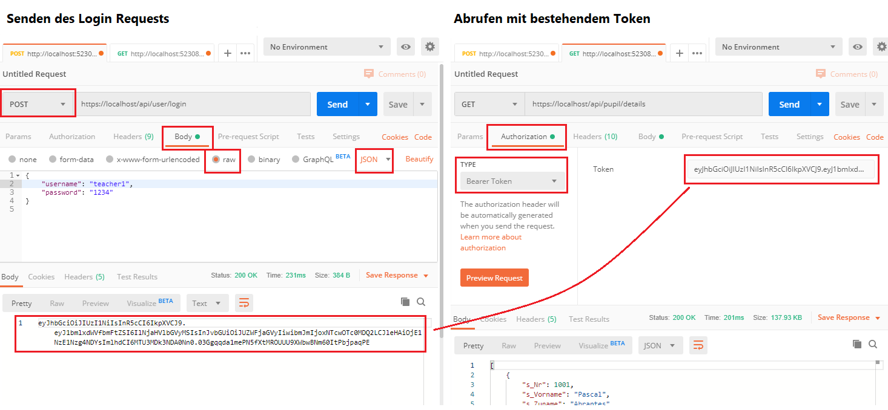

# Authentication in einer ASP.NET WebAPI Anwendung

## Erstellen eines neuen WebAPI Projektes

Um das Projekt neu zu erstellen, wird eine normale WebAPI Anwendung in der Konsole erstellt. Es wird
auch gleich das Paket *Microsoft.AspNetCore.Authentication.JwtBearer* für die JWT Authentifizierung
eingebunden.

```text
md AuthDemo
cd AuthDemo
dotnet webapi new
dotnet add package Microsoft.AspNetCore.Authentication.JwtBearer
```

## Generieren eines Secret und Anpassen der *appsettings.json*

Für JWT benötigen wir ein Secret. Es wird zur Prüfung der Signatur des Tokens verwendet. Auf
https://generate.plus/en/base64 kann ein beliebig langer Base64 String generiert werden. Für ein
1024bit langes Secret verwenden wir eine 128 Byte lange Zufallszahl.

Nun kopieren wir das Secret in die Datei *appsettings.json*, damit unser Programm später darauf
zugreifen kann.

> **Achtung:** Die Datei *appsettings.json* sollte dann nicht öffentlich hochgeladen werden, denn
> jeder kann mit diesem Secret gültige Token für unsere Applikation erzeugen.

```javascript
{
  "AppSettings": {
    "Secret": "pdS//LMPmOwlxcJDwz++m+rxNcDG1/hjh/K6Pm5KyQ1AjVCpnnkFuTpgPBqRSkvtqqbWkE04XC3jveRfMIdWZgu8ounByV7CaWbxRVsKXzWVvQKSDLUfVpidcieJ7BibvpHby28ONbMLZY961bazukxIjwn68DVPI0hExJ9eyZw="
  },
  "Logging": {
    "LogLevel": {
      "Default": "Information",
      "Microsoft": "Warning",
      "Microsoft.Hosting.Lifetime": "Information"
    }
  }
}
```

## Erstellen einer POCO Klasse für die User Credentials

In [Model/UserCredentials.cs](Model/UserCredentials.cs) wird einfach eine Klasse *UserCredentials* erstellt,
die Benutzername und Passwort aus dem POST Request aufnehmen soll.

## Erstellen eines User Services

Das UserService in [Services/UserService.cs](Services/UserService.cs) hat folgende Methoden:

- Die Methode *CreateUser()* legt einen neuen Benutzer an, indem sie ein Salt generiert und den
  Passworthash, mit dem verglichen wird, speichert. Sie ist auskommentiert, da sie natürlich
  den Gegebenheiten anzupassen ist. In der auskommentierten Methode wird das Speichern in einer
  Usertabelle, die so aussieht wie im Kapitel [04a_AuthenticationPrinciples](../04a_AuthenticationPrinciples)
  anskizziert.
- Die Methode *GenerateToken()* prüft die übergebenen Credentials. Auch hier sind Anpassungen vorzunehmen,
  in dieser Version werden die Benutzer *pupil1* und *teacher1* mit dem Passwort *1234* fix als
  gültig erkannt. Sie weist nach erfolgreicher Authentifizierung die Rolle zu und erstellt den
  JSON Web Token als String.

## Registrieren des Services und Aktivieren von JWT

Nun muss durch Anpassen von *ConfigureServices()* in *Startup.cs* noch der Code für die JWT
Authentication hinzugefügt werden. Der Key wird aus *appsettings.json* gelesen.

Danach wird mit *AddScoped()* unser Userservice mit dem gelesenen Secret instanziert.

```c#
public void ConfigureServices(IServiceCollection services)
{
    // ...

    // JWT Aktivieren
    byte[] key = Convert.FromBase64String(Configuration["AppSettings:Secret"]);
    services.AddAuthentication(x =>
    {
        x.DefaultAuthenticateScheme = JwtBearerDefaults.AuthenticationScheme;
        x.DefaultChallengeScheme = JwtBearerDefaults.AuthenticationScheme;
    })
    .AddJwtBearer(options =>
    {
        // Damit der Token auch als GET Parameter in der Form ...?token=xxxx übergben
        // werden kann, reagieren wir auf den Event für ankommende Anfragen.
        options.Events = new JwtBearerEvents
        {
            OnMessageReceived = ctx =>
            {
                string token = ctx.Request.Query["token"];
                if (!string.IsNullOrEmpty(token))
                    ctx.Token = ctx.Request.Query["token"];
                return Task.CompletedTask;
            }
        };
        options.TokenValidationParameters = new TokenValidationParameters
        {
            ValidateIssuerSigningKey = true,
            IssuerSigningKey = new SymmetricSecurityKey(key),
            ValidateIssuer = false,
            ValidateAudience = false
        };
    });

    // Instanzieren des Userservices mit einer Factorymethode. Diese übergibt das gespeicherte
    // Secret.
    services.AddScoped<UserService>(services => 
        new UserService(Configuration["AppSettings:Secret"]));
}
```

Nun wird in der Methode *Configure()* die Authentifizierung und Autorisation aktiviert. Beachte dabei
die Position der Anweisungen innerhalb der Methode. Das ist bei *Configure()* generell sehr wichtig.

```c#
public void Configure(IApplicationBuilder app, IWebHostEnvironment env)
{
    //...
    // Muss NACH UseRouting() und VOR UseEndpoints() stehen.
    app.UseAuthentication();
    app.UseAuthorization();
    // ...
}
```

## Erstellen eines Login Controllers

Damit sich die Benutzer anmelden bzw. registrieren können, erstellen wir in
[Controller/UserController.cs](Controllers/UserController.cs) einen Controller mit 2 Routen:

- *POST /api/user/login:* Bekommt ein UserCredentials Objekt als POST Request und sendet den
  generierten Webtoken als String. Bei einem fehlerhaften Login wird HTTP 401 gesendet.
- *POST /api/user/register:* Registriert einen neuen User. Diese Methode ist auskommentiert,
  da sie natürlich an das Programm angepasst werden muss.

Beachte die Annotation *[Authorize]* zu Beginn des Controllers und *[AllowAnonymous]* über den
einzelnen Routen. Erstere aktiviert die Authorisierung für den Controller, Zweitere erlaubt den
anonymen Zugriff auf die Route.

## Verwenden im PupilController

Zur Demonstration eines "echten" Controllers mit Autorisation wird die Datei
[Controller/PupilController.cs](Controllers/PupilController.cs) angelegt.

```c#
// ...
[Authorize]                       // Aktiviert die Authentication für den Controller.
public class PupilController : ControllerBase
{
    // SZENARIO 1: Anonymer Zugriff erlaubt ********************************************************
    [AllowAnonymous]             // Jede Route ist geschützt, außer wir setzen AllowAnonymous
    [HttpGet]
    public string Get()
    {
        return "This Information is for all Users.";
    }

    // SZENARIO 2: Zugriff mit (beliebigem) gültigen Token erlaubt *********************************
    // Da Authorize im Controller gesetzt ist muss hier nichts geschrieben werden.
    [HttpGet("me")]
    public ActionResult<string> GetMyData()
    {
        // Benutzername angemeldeten Users herausfinden.
        string username = User.Claims.FirstOrDefault(c => c.Type == ClaimTypes.Name)?.Value ?? "";
        // Die Rolle kann auch herausgesucht werden, ist hier aber nicht nötig.
        // string role = User.Claims.FirstOrDefault(c => c.Type == ClaimTypes.Role)?.Value;

        // ...
    }

    // SZENARIO 3: Nur ein Token mit der eingetragenen Rolle Teacher ist erlaubt********************
    [Authorize(Roles = "Teacher")]
    [HttpGet("details")]
    public IEnumerable<string> GetDetails()
    {
        // ...
    }
}
```

## Testen mit Postman

Zum Testen der Applikation starte diese mit *dotnet run*. Es können 2 gültige Benutzer gesendet
werden: *{ "username": "pupil1", "password": "1234" }* und *{ "username": "teacher1", "password": "1234" }*.

Diese Daten werden als POST Request an *https://localhost/api/user/login* gesendet. Der
zurückgegebene String wird dann bei einem GET Request auf *https://localhost/api/pupil/me* oder
*https://localhost/api/pupil/details* als Bearer Token im Authentication Header gesendet.



