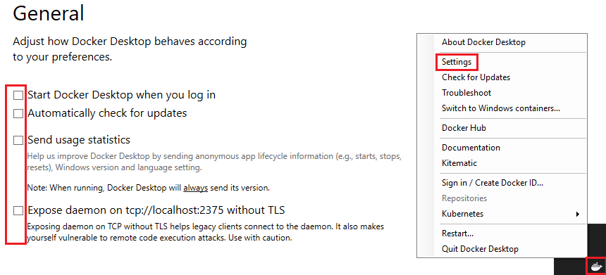

# Microservices mit Microsoft .NET

WebApi Anwendungen sind auch die Basis von Microservices. Große Anwendungen werden dabei in mehrere kleinere, 
genau abgegrenzte REST APIs unterteilt.


<sup>Quelle: https://docs.microsoft.com/en-us/dotnet/architecture/microservices/secure-net-microservices-web-applications/</sup>

Zum Erstellen wird heute oft Docker verwendet. Docker für Windows kann von 
[download.docker.com](https://download.docker.com/win/stable/Docker%20for%20Windows%20Installer.exe)
über diesen Link auch ohne Login geladen werden. In Visual Studio Code kann mit der Extension *Docker*
das Erstellen von Dockerfiles vereinfacht werden. Außerdem wird dann in der Iconleiste links die
Möglichkeit angeboten, die verfügbaren Dockerimages einzusehen.

Unter https://dotnet.microsoft.com/learn/aspnet/microservice-tutorial/intro findet sich eine Schritt für Schritt
Anleitung zum Erstellen von Microservices in Docker Containern. Diese Anleitung basiert noch auf .NET
Core 2.2, es können aber die *FROM* Anweisungen im Dockerfile problemlos auf 3.0 aktualisiert werden:
```
FROM mcr.microsoft.com/dotnet/core/sdk:3.0  
FROM mcr.microsoft.com/dotnet/core/aspnet:3.0
```

## Docker und Virtual Box
Docker aktiviert den Windows eigenen Virtualisierungsdienst Hyper-V. Dadurch können Virtuelle Maschinen
mit Oracle Virtual Box nicht mehr gestartet werden. Falls so eine Maschine gestartet werden soll,
muss die Eingabeaufforderung als Administrator ausgeführt werden. Der Befehl
```
bcdedit /set hypervisorlaunchtype off
```
deaktiviert den HV-Hostdienst. Nach einem Neustart kann die VM gestartet werden. Nur ein deaktivieren
des Dienstes ohne Neustart funktioniert nicht.

Um wieder Docker nutzen zu können, muss der Dienst wieder als Administrator in der Konsole auf 
automatisch starten gesetzt werden. Nach einem Neustart kann mit Docker gearbeitet werden.
```
bcdedit /set hypervisorlaunchtype auto
```

Wenn nicht automatisch Dockercontainer beim Systemstart ausgeführt werden sollen, kann der Autostart
von Docker auch deaktiviert werden:

