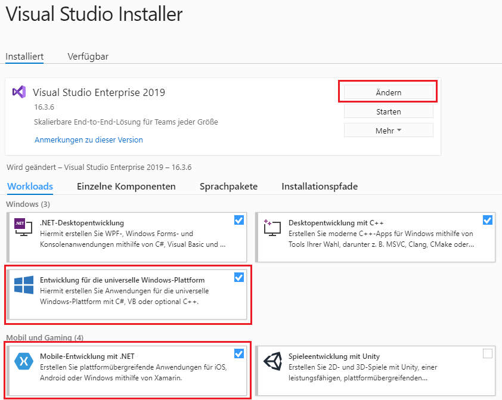
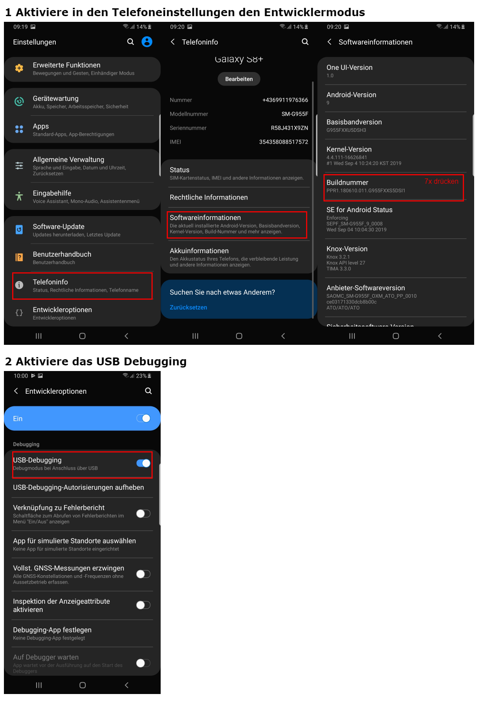
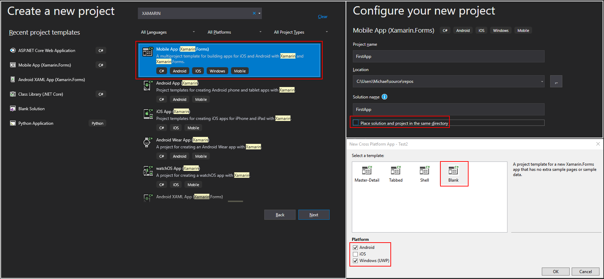

# Erstellen und Ausführen der ersten App

## Prüfen der Visual Studio Komponenten
Starte den *Visual Studio Installer* und führe gegebenenfalls ein Visual Studio Update durch.
Prüfe, ob die folgenden Pakete installiert sind. 
- Entwicklung für die universelle Windows Plattform
- Mobile-Entwicklung mit .NET

## Konfigurieren des Android Telefons
Um Apps auf das Smartphone zu übertragen, müssen die Entwickleroptionen und das USB Debugging aktiviert
werden. Wird das Telefon mit dem PC verbunden, muss zudem noch der Übertragungsmodus geändert werden.

## Erstellen einer Visual Studio Solution
Erstelle nun ein neues Visual Studio Projekt. Gib im Suchfeld XAMARIN ein, dann erscheint die Option
*Mobile App (Xamarin.Forms)*. Als Zielplattform wähle *Android und Windows (UWP)*. Projekte für iOS können
mit Xcode und macOS erstellt werden. Für free provisioning mit Xcode gibt es auf 
[Microsoft Docs](https://docs.microsoft.com/en-us/xamarin/ios/get-started/installation/device-provisioning/free-provisioning?tabs=windows)
eine Anleitung.

## Kompilieren und Ausführen von UWP und Android Applikationen
Wurde die Visual Studio Solution erstellt, können 2 Projekte gestartet werden. Das UWP Projekt wird
auf dem lokalen PC ausgeführt und ist die schnellste Möglichkeit für Tests. Beim ersten Start muss
noch der Entwicklermodus in den Windows Einstellungen, die automatisch geöffnet werden, aktiviert werden.

Beim ersten Erstellen von Android Apps erscheint eine Fehlermeldung, dass keine Android SDK installiert
wurde. Beim Klicken auf diese Meldung öffnet sich der SDK Manager, und man kann eine SDK für den Emulator
(z. B. für Android 8) installieren.

Nachdem die SDK installiert ist, muss Visual Studio neu gestartet werden. Wird nach dem Neustart
das Smartphone angeschlossen erscheint am Display eine Meldung, ob USB Debugging von diesem PC aus
zugelassen werden soll. Hier kann man gleich den Haken setzen, dass der aktuelle PC gespeichert wird.
Nach Zulassen des USB Debugging bietet Visual Studio auch das direkte Übertragen zum Android Gerät an.

> **Achtung:** Der Buildprozess dauert im Gegensatz zu Konsolen- oder Windowsapplikationen länger. Führe
> vor dem übertragen mit *Build* - *Build Solution* einen vollständigen Build durch. In der Statusleiste unten
> wird der Fortschritt sichtbar. Erst nach erfolgreichem Build ist ein Starten möglich.

## Erste Hilfe bei Build-Problemen
Der Buildprozess ist natürlich komplexer und daher auch fehleranfälliger. Bei Problemem hilft oft folgende
Vorgehensweise:
1. Schließe Visual Studio.
1. Trenne das Telefon vom Rechner.
1. Lösche die *bin* und *obj* Ordner in allen Projekten (Gemeinsames, UWP und Android Projekt). Falls die
   Ordner wegen Zugriffsproblemen nicht gelöscht werden können, starte den Rechner neu und lösche danach
   diese Ordner.

