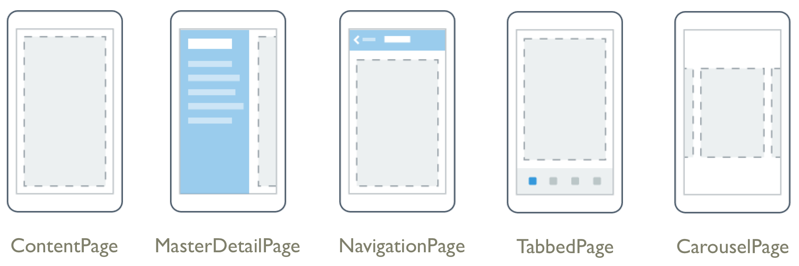
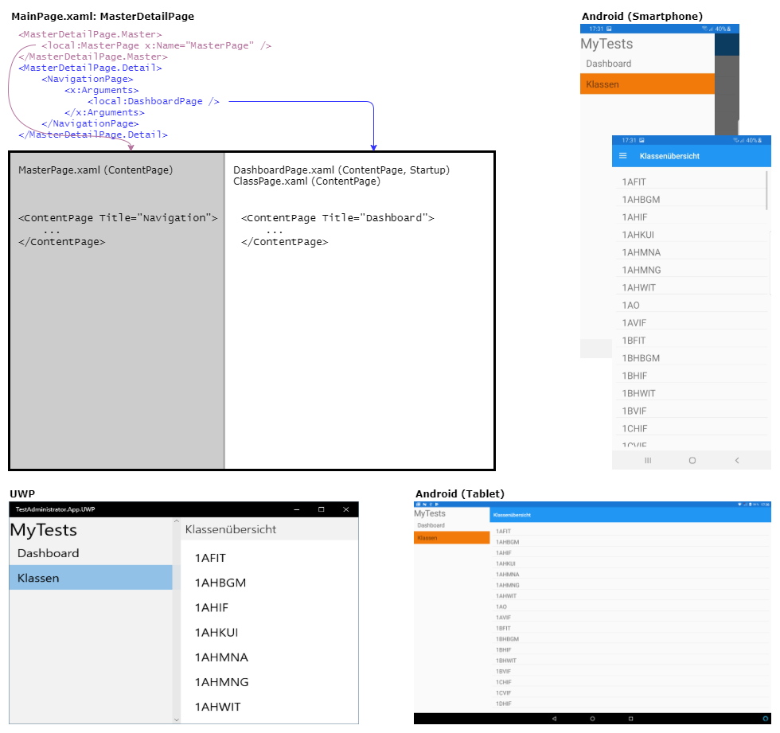
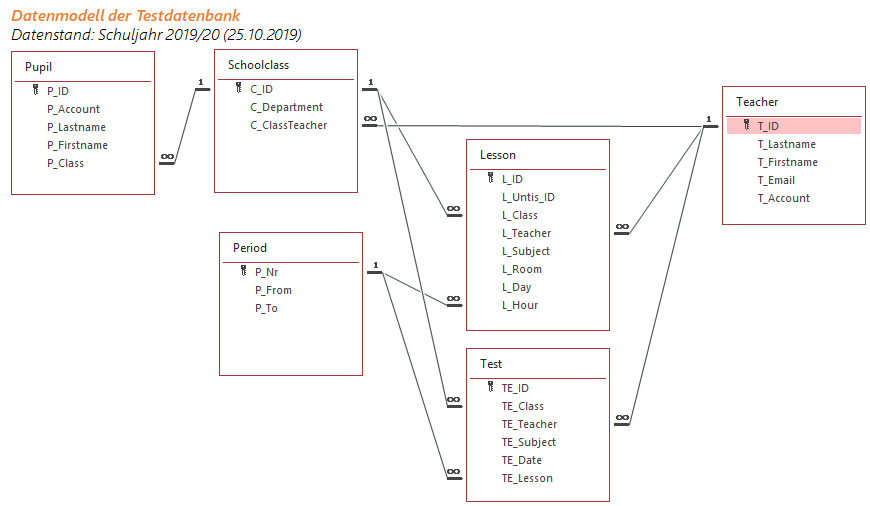

# Master Detail View
Eine Xamarin App besteht aus mehreren Elementen:

| Element | Bedeutung   |
| ------- | ----------- |
| Page    | Am Gerät angezeigte Seite. Entspricht dem Fenster in WPF bzw. der Activity in Android. Sie beinhaltet ein Layout, welches die Viewelemente anordnet. |
| Layout  | Die Elemente können auf der Seite angeordnet werden. Es gibt *StackLayout*, *Grid*, *AbsoluteLayout* und *RelativeLayout*. |
| View    | Entspricht den UI Controls wie *Labels*, *Buttons*, *ListViews*, ... Der Name verwirrt etwas, da man oft denkt dass es sich um die Seite (Page) handelt. |


## Pages und Navigation
In Xamarin.Forms werden verschiedene Pages angeboten, die dann auf die Geräteabhängige GUI abgebildet
werden:



<sup>Quelle: https://docs.microsoft.com/de-de/xamarin/xamarin-forms/app-fundamentals/navigation/</sup>

Da durch die Größe eines Smartphones oft zwischen Seiten gewechselt werden muss, kommt der Navigation
eine besondere Bedeutung zu. Oft ist die *MasterDetailPage* der Einstieg für die App. Sie besteht aus
2 ContentPages, wobei die MasterPage immer über das Navigationsicon aufgerufen werden kann. Die
"variable" Seite ist eine *NavigationPage*, also eine ContentPage mit Navigationsstack.

## Umsetzung im Musterprojekt
Wenn in Visual Studio im App Projekt mit Add - New Item ein neues Objekt hinzugefügt wird, können
die verschiedenen Page Typen gewählt werden:
- Content Page (der häufigste Typ)
- List View Page
- Master Detail Page
- Tabbed Page
- HTML Page

Diese Vorlagen generieren unter Umständen schon recht viel Code und Unterseiten, deswegen ist oft
das Anlegen einer "normalen" Content Page und das Ändern des XAML Codes der schnellere Ansatz.

### Die MainPage
Oft ist die Unterscheidung zwischen MainPage und MasterPage schwierig. Die MainPage ist ein Container,
der auf die Masterpage und die erste anzuzeigende DetailPage verweist:



In der Datei [App.xaml.cs](TestAdministrator.App/TestAdministrator.App/App.xaml.cs) befindet sich der 
Startpunkt der App. Im Konstruktor wird die erste Seite geladen:
```c#
public App()
{
    InitializeComponent();

    MainPage = new MainPage();
}
```

Die MainPage in [MainPage.xaml](TestAdministrator.App/TestAdministrator.App/MainPage.xaml) ist vom 
Typ *MasterDetailPage* und verweist auf 2 Unterseiten, die beim Laden der App angezeigt werden. 
Beachte, dass es sich bei der ersten Detail Page um eine NavigationPage handelt, damit zur MasterPage 
navigiert werden kann. Die einzelnen Seiten werden mit *local* als Objekte gesucht.

### Die MasterPage
Die MasterPage beinhaltet die Navigation. In der Datei [MasterPage.xaml](TestAdministrator.App/TestAdministrator.App/MasterPage.xaml) 
befindet sich der XAML Code, der die verschiedenen Unterseiten, zu denen der Benutzer navigieren kann, 
aufgelistet werden.

Diese Seite hat im [CodeBehind](TestAdministrator.App/TestAdministrator.App/MainPage.xaml.cs) einen 
Eventhandler für die Liste, der die neue DetailPage mit einem Navigationsstack versieht und die 
MasterPage nach dem Anzeigen ausblendet.
```c#
private void NavigationList_ItemSelected(object sender, SelectedItemChangedEventArgs e)
{
    MasterDetailPage mainPage = App.Current.MainPage as MasterDetailPage;
    NavigationItem item = e.SelectedItem as NavigationItem;
    if (mainPage != null && item != null)
    {
        mainPage.Detail = new NavigationPage((Page)Activator.CreateInstance(item.TargetType));
        mainPage.IsPresented = false;
    }
}
```

### Die DetailPages

Die DetailPages entsprechen weitgehend dem XAML Code, der auch bei WPF Anwendungen verwendet wird.
Sie unterstützen Bindings und ein ViewModel. In [ClassPage.xaml](TestAdministrator.App/TestAdministrator.App/ClassPage.xaml)
werden zum Beispiel alle vom Server geladenen Klassen als Liste angezeigt. Dieses Laden wird im Event
*Appearing* der Seite aufgerufen, also immer wenn die Liste am Bildschirm erscheint. Wird auf einen Eintrag
der Liste geklickt, so wird die Seite ClassDetailPage aufgerufen, die die Informationen zur gewählten
Klasse anzeigt. Im [CodeBehind](TestAdministrator.App/TestAdministrator.App/ClassPage.xaml.cs) sieht
man das Reagieren auf den Event.

### Die ViewModels

Unsere Viewmodels leiten sich alle von [BaseViewModel](TestAdministrator.App/TestAdministrator.App/ViewModels/BaseViewModel.cs)
ab. Diese Klasse implementiert einerseits das INotifyPropertyChanged Interface zum Aktualisieren der
gebundenen Felder, andererseite lädt es das [RestService](TestAdministrator.App/TestAdministrator.App/Services/RestService.cs) 
vom Service Locator.

Teilweise werden die ViewModels in XAML über *ContentPage.BindingContext* eingebunden, falls sie keine
Argumente im Konstruktor haben. Bei Argumenten wird im CodeBehind der *BindingContext* gesetzt, so
wie in [ClassDetailPage.xaml.cs](TestAdministrator.App/TestAdministrator.App/ClassDetailPage.xaml.cs).

### Etwas heikel: Laden vom Server, bevor die Seite dargestellt wird

Da Konstruktoren nicht *async* sein dürfen, behelfen wir uns mit dem Factorypattern. Im Falle des
[DashboardViewModel](TestAdministrator.App/TestAdministrator.App/ViewModels/DashboardViewModel.cs)
wird in der *FactoryAsync()* Methode der Request *.../api/dashboard* abgesetzt
und das Ergebnis in Response geschrieben. Den Standardkonstruktor machen wir *private*,
damit nicht ein Viewmodel ohne Initialisierung erzeugt werden kann.

```c#
public class DashboardViewModel : BaseViewModel
{
   private readonly RestService _restService = DependencyService.Get<RestService>();
   public string Response { get; set; }

   private DashboardViewModel() { }
   public static async Task<DashboardViewModel> FactoryAsync()
   {
      DashboardViewModel vm = new DashboardViewModel();
      vm.Response = (await vm._restService.SendAsync<List<string>>(HttpMethod.Get, "dashboard"))[0];
      return vm;
   }
}
```

[DashboardPage.xaml.cs](TestAdministrator.App/TestAdministrator.App/ClassDetailPage.xaml.cs) bekommt
nun einen Konstruktor, der ein fertig erstelltes Viewmodel erwartet.
So umgehen wir das *async* Problem im Konstruktor. Den Standardkonstruktor machen wir *private*,
damit nicht eine Seite ohne Initialisierung erzeugt werden kann.

```c#
public partial class DashboardPage : ContentPage
{
   private DashboardPage()
   {
      InitializeComponent();
   }
   public DashboardPage(DashboardViewModel vm) : this()
   {
      BindingContext = vm;
   }
}
```

Jetzt ergibt sich in der MainPage das Problem, dass in
[MainPage.xaml](TestAdministrator.App/TestAdministrator.App/MainPage.xaml) die Detailseite als erste
Seite dargestellt wird. Dadurch wird aber der Standardkonstruktor aufgerufen. Wir umgehen das Problem,
indem wir im Konstruktor der Seite in
[MainPage.xaml.cs](TestAdministrator.App/TestAdministrator.App/MainPage.xaml.cs)
die Detailseite im Programmcode setzen. Den Konstruktor machen wir zur Sicherheit wieder *private*.
Wichtig ist der Aufruf von *InitializeComponent()* mit *this()*.

```c#
public partial class MainPage : MasterDetailPage
{
   private MainPage()
   {
      InitializeComponent();
   }
  public MainPage(Page detailPage) : this()
   {
      Detail = detailPage;
   }
}
```

Zum Schluss muss noch [App.xaml.cs](TestAdministrator.App/TestAdministrator.App/App.xaml.cs)
angepasst werden. Denn die MasterPage wird im Konstruktor gesetzt, was natürlich nicht mehr
möglich ist. Deswegen verwenden wir das *OnStart()* Event.

```c#
public partial class App : Application
{
   public App()
   {
      InitializeComponent();
   }

   protected override async void OnStart()
   {
      MainPage = new MainPage(new DashboardPage(await DashboardViewModel.FactoryAsync()));
   }
   // ...
}
```

## Übung

Das Dashboard soll alle in der Datenbank eingetragenen Tests des angemeldeten Lehrers anzeigen. Da
wir noch keine Loginseite haben, können wir das Login im Code wie in 
[ClassDetailViewModel.cs](TestAdministrator.App/TestAdministrator.App/ViewModels/ClassDetailViewModel.cs)
einfach vor dem Request senden.

Um diese Aufgabe zu lösen, bearbeite folgende Punkte:

1. Erstelle eine DTO Klasse *TestDto*, die alle relevanten Daten über den Test liefert. Dies sind alle
   Einträge in der Tabelle Tests und zudem noch der Klassenvorstand der betroffenen Klasse.

1. Erstelle einen Controller Tests, der auf den Request *GET /api/tests/teacher/(accountname)* reagiert. Diese Route
   soll *IEnumerable&lt;TestDto&gt;* liefern, allerdings nur wenn der angemeldete User auch den selben Accountnamen hat wie 
   in der URL angegeben. Andernfall soll HTTP 403 geliefert werden. In der Datenbank befindet sich 
   der Accountname der Lehrer in der Spalte *T_Account* der Tabelle *Teacher*. Benutzername und Rolle 
   können in der Methode *Logout()* von
   [UserController.cs](TestAdministrator.Api/Controllers/UserController.cs) ermittelt werden.

1. Teste in Postman, indem du dich mittels *POST /api/user/login* mit einem gültigen Accountnamen (z. B. *schletz*) 
   anmeldest. Da das Userservice das Passwort (noch) nicht prüft, wird bei jedem Passwort ein Token 
   geliefert. Danach solltest du mit *GET api/tests/teacher/SZ* 6 Tests als JSON Array sehen.

1. Füge in [RestService.cs](TestAdministrator.App/TestAdministrator.App/Services/RestService.cs) der
   App eine Methode *GetTestsByTeacherAsync(string teacherId)* ein, die *Task&lt;IEnumerable&lt;TestDto&gt;&gt;* 
   liefert. Verwende dabei die Methode *SendAsync()* des Rest Services, wie sie von *GetClassDetailsAsync()* 
   aufgerufen wird.

1. Ändere dem XAML Code von [DashboardPage.xaml](TestAdministrator.App/TestAdministrator.App/DashboardPage.xaml),
   sodass ein neu erstelltes Viewmodel eingebunden wird. Die Darstellung der Tests erfolgt als *ListView*,
   das Layout kann beliebig gewählt werden.

## Datenbankschema

Die Musterdatenbank *Tests.db* hat folgenden Aufbau:

